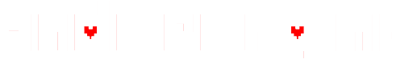
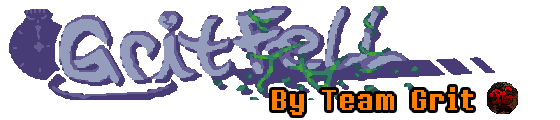

### Hi there! 👋
I'm Neon-Gr33n, an avid **programmer**, **game developer**, and learning musician
I'm [Neurodivergent](https://www.health.harvard.edu/blog/what-is-neurodiversity-202111232645) more specificially, my conditions are Autism Spectrum Disorder (ASD) and Attention-Deficit Hyperactive Disorder (ADD)
but I don't let any of these conditions stop me from what I love doing! live and let live, is what I always say.

I'm currently working on 

#Tech Stack

<!--
**neon-gr33n/neon-gr33n** is a ✨ _special_ ✨ repository because its `README.md` (this file) appears on your GitHub profile.

Here are some ideas to get you started:

- 🔭 I’m currently working on ...
- 🌱 I’m currently learning ...
- 👯 I’m looking to collaborate on ...
- 🤔 I’m looking for help with ...
- 💬 Ask me about ...
- 📫 How to reach me: ...
- 😄 Pronouns: ...
- ⚡ Fun fact: ...
-->
