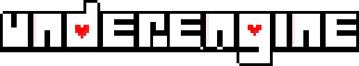

# Hi there! 👋
I'm Neon-Gr33n, I'm an avid **programmer**, **game developer**, and learning musician
I'm [Neurodivergent](https://www.health.harvard.edu/blog/what-is-neurodiversity-202111232645) more specificially, my conditions are Autism Spectrum Disorder (ASD) and Attention-Deficit Hyperactive Disorder (ADD)
but I don't let any of these conditions stop me from what I love doing! live and let live, is what I always say.

I'm currently working on 

As far as pronouns go, I'm comfortable with any, I do not mind in the slightest.

Curious? have questions? feel free to contact me using any of the contact methods listed below, one thing I'd like to note however is
1. My timezone is EST (Eastern Standard Time UTC−05:00)
Thank you.

<!--
**neon-gr33n/neon-gr33n** is a ✨ _special_ ✨ repository because its `README.md` (this file) appears on your GitHub profile.

Here are some ideas to get you started:

- 🔭 I’m currently working on ...
- 🌱 I’m currently learning ...
- 👯 I’m looking to collaborate on ...
- 🤔 I’m looking for help with ...
- 💬 Ask me about ...
- 📫 How to reach me: ...
- 😄 Pronouns: ...
- ⚡ Fun fact: ...
-->
